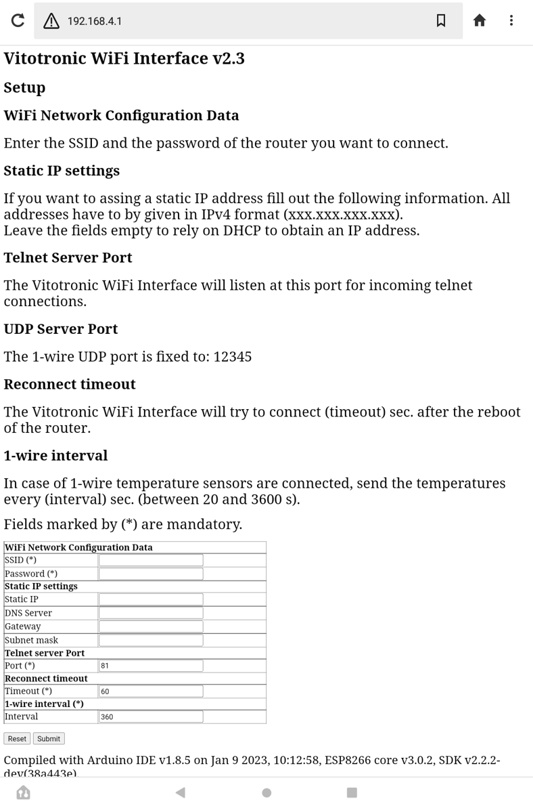
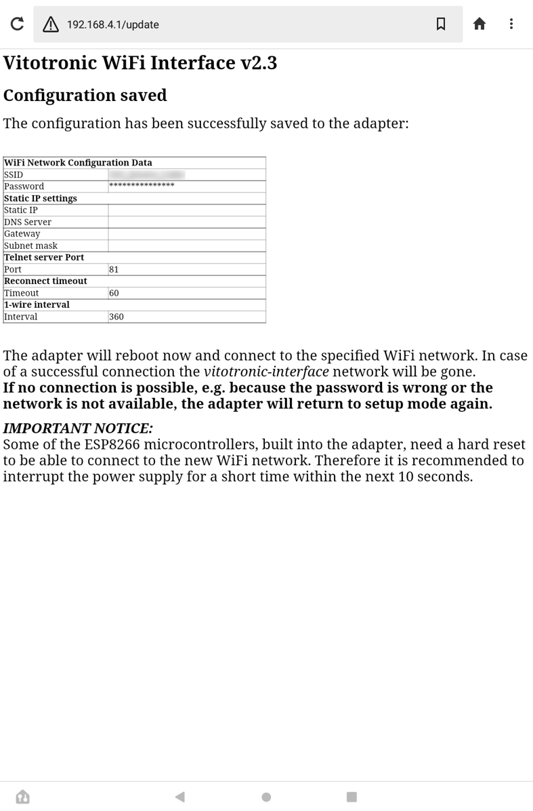

# vitotronic_interface

ESP8266 WiFi to serial interface, built to connect to a Viessmann Vitotronic heating control. The heating control is accessed by using an *Optolink*, according to the instructions in the [OpenV wiki](https://github.com/openv/openv/wiki/Adapter-Eigenbau) and made available as TCP/telnet server in the WiFi network. The communication bewteen the ESP8266 and the heating (via the *Optolink*) runs at 4800 bps, 8 bits, even parity, 2 stop bits.

## Changelog *Optolink* hardware
### v1.x:
 - ~~GPIO0 for 1-wire~~ don't use as the level shifter is not working
 - GPIO2 for debug messages
 - GPIO12 for config
 - 512k RAM/64k SPIFFS (ESP8266-ESP03/04)
### v2.x:
 - GPIO0 for 1-wire (only from v2.1 onwards)
 - GPIO2 for config (or for debug messages alternatively)
 - 1M RAM/64k SPIFFS (in case of black ESP8266-ESP01 modules)
### v3.x by STB3:
- Button for reconfiguring
- Split design base with ESP8266 and sattelite board for the optical connection

## Changelog firmware
### v1.0:
Initial version by renemt.

### v1.1 (PeMue):
- added some comments for better understanding
- debug output disabled for default (can be switched on again)

### v1.2 (PeMue):
- added parameter timeout to ensure a proper connection to the router after reboot (e.g. in case of power loss)
- changed default port from 8888 to 81 (like in Lacrosse GateWay)

### v1.3 (PeMue):
- added OTA flash possibility
- print firmware version on setup and success page

### v2.0 (PeMue):
- added 1-wire temperature measurement (only for hardware >=v2.2)
- check if 1-wire sensors are available and if yes, send the values via UDP
- added the interval for 1-wire measurement to the setup page

### v2.1 (PeMue):
- reset cycle counter every 24 h, unsigned long instead of long
- apply patch for static configuration from [FHEM forum](https://forum.fhem.de/index.php/topic,51932.msg451195.html#msg451195)
- added date of compilation
- added patch for interrupt routine (ICACHE_RAM_ATTR) from [here](https://stackoverflow.com/questions/58113937/esp8266-arduino-why-is-it-necessary-to-add-the-icache-ram-attr-macro-to-isrs-an)

### v2.2 (PeMue):
- changed from SPIFFS to LittleFS
- **CAUTION:** Please erease complete ESP8266 chip before flashing new firmware.

### v2.3 (STB3)
 - Moved html pages to LittleFS to clearly divide between html and C++ code
 - Adopted routines reading the html code previously from a variable
 - now using PlaformIO/VSCode as IDE

## Flashing the firmware
1. Install Visual Studio Code
2. Install the PlatformIO toolbox
3. Open the Folder. File/Open Folder...
4. Select PlatformIO Logo on the left side of the IDE
5. Be sure to have the right project (esp01_1m)
6. Click Build
7. Click Build Filesystem Image
8. Upload
9. Upload Filesystem Image

## Setting up the *Optolink* hardware
* Wire up the ESP8266 and power supply.
* Connect the *Optolink* to the heating, connect *IN/RX* with the ESP8266 *RX* line and *OUT/TX* with the ESP8266 *TX* line, as well as *VCC* and *GND* to 3.3V and Ground.
* If you want to retrieve debugging output, connnect a serial port's *RX* line to *GPIO2* of the ESP8266 at 115200 bps, 8N1. Don't forget to connect *GND* of the port as well to *GND* of the ESP8266. Works like charm with an FTDI USB-to-serial adapter.

## Configuring the adapter
As long as the ESP of the adapter is not configured for connecting to a WiFi network it will provide an own WPA2-secured WiFi access point for configuration. To set up the adapter,
* Scan your WiFi environment for the SSID *"vitotronic-interface"*.
* Connect to this network, using the password *"vitotronic"*.
* In your web browser, go to http://192.168.4.1

<table><tr><td>
	
</td></tr></table>	

* Provide the required configuration information:
  * **SSID** of the WiFi network to connect to (mandatory)
  * **Password** for the WiFi network
  * If you want to assign a static IP to the adapter, specify
    * **IP** address to be assigned to the adapter
    * **DNS** server address
    * **Gateway** address
    * **Subnet Mask**
  * The **Port** at which the adapter listens for an incoming connection (mandatory)
  * A **Timeout** value (in s) which the adapter should wait after reboot to re-establish WLAN connection (mandatory).
  * The **1-wire interval** time (in s) when the 1-wire data will be sent (mandatory).
* Press "Submit" afterwards. The adapter will save the configuration, restart and connect to the given WiFi network. Afterwards the server will be reachable in the network at the IP (DHCP or static) and specified port. The server's IP is also pingable.

<table><tr><td>
    
</td></tr></table>

**Important notice:** Some ESP8266 modules need a "hard reset" to be able to connect to the new WiFi network. Therefore it is recommended to interrupt the power supply for a short time after the new configuration has been submitted. If the connection was successful, the *vitotronic-interface* network will be gone and the adapter should be pingable in the specified network.

## Re-configuring the adapter
To re-configure the adapter, connect *GPIO2* (hardware v2.x) to *GND* for a short time (e.g. by a pushbutton). Thus, the existing configuration will be deleted and the adapter will enter setup mode again (see above).
On STBs adapter use the built in button to reconfigure the adapter.
